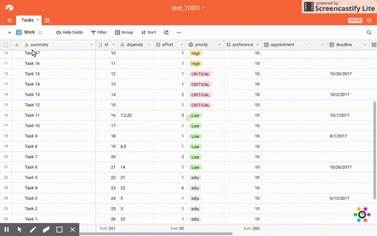
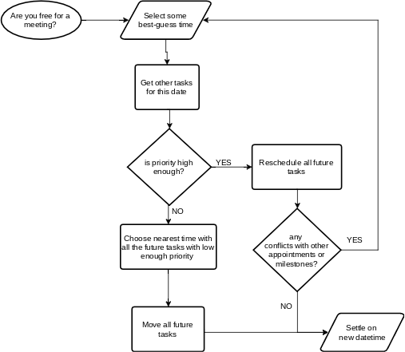

Unix: [](https://travis-ci.org/grandrew/taskjuggler-python) Windows: [](https://ci.appveyor.com/project/grandrew/taskjuggler-python)<br>Metrics: [](https://coveralls.io/r/grandrew/taskjuggler-python) [](https://scrutinizer-ci.com/g/grandrew/taskjuggler-python/?branch=master)<br>Usage: [](https://pypi.python.org/pypi/taskjuggler_python)



# Rationale

It's **[whatever current year]** and still most of the tasks/project management tools lack support for any means of automated planning. This library helps to integrate automated planner that's been available for over a decade, with a shot of suporting different front-ends, complex scheduling strategies and potentially different planners.



Realize your craziest time management dreams!

- Current focus is on personal planning and small teams (hence no support for multiple resource yet)
- No configuration is required to start
- Utility airtable API example provided with advanced planning strategy (see below)

# Overview

`python_taskjuggler` module provides python interfaces to TaskJuggler 3 planner. It is a set of base classes that provide object abstractions that TaskJuggler internally uses. The module comes with example implementation of JSON project description parser.

It is still work in progress and currently supports:

- generating taskjuggler project file
- runnig the planner
- importing task bookings
- working with single default resource `"me"`

The package comes with an example command line utility `tjp-client` that provides automatic planning for
tasks defined as records in [airtable](https://airtable.com) table. 
Working with google sheets, jira, trello, todoist, smartsheet and others could be implemented the same way.

The utility allows to immediately re-schedule to reflect any changes to the plans that may arise due to new fixed appointments, dependencies, priority amendments or required efforts re-evaluation.

## Command-line utility usage:

```
$ tjp-client -a airtable -k <airtable_api_key> -b <airtable_database> -t <table_name> -v <view_name>
```

### Preparation

1. Create an [airtable](https://airtable.com) database by copying [this example base](https://airtable.com/shrivEunRhLcBm79R) or create a new database with table named "Tasks" with the following columns (**case sensitive**): 

```

1. id           - the integer (number) field used as task ID. "Auto Number" type recommended.
2. summary      - single line text: task summary / title
3. effort       - integer number: task effort duration measured in hours. Default value of 1 recommended
4. priority     - single select: field with values "CRITICAL", "High", "Low", "info"
5. preference   - integer number: optional additional number 0-99 for higher granularity of priorities
6. depends      - single line text: with dependencies listed as id's, like: 2,3,4
7. appointment  - date field with time: the fixed tasks or appointments that can not be moved
8. deadline     - date: the desired deadline value. Current strategy will use it to emphasize priority if missed.
9. booking      - date+time: this is where output will be written to. Sort your table by this column

Other columns are just ignored.

You can add nice calculations to the table like time difference between deadline and calculated booking.

```
2. Create a view called `Work` with all the tasks with status "Done" filtered out *(it is left as an exercize for the reader to create a new column and a filter for it)*
3. Create a calendar view with `booking` field
4. Add some tasks and appointments. Beware not to add impossible scenarios - those are not supported yet (see console output to check)
5. Get `API key`, `database ID`, note your table name and view name should be `Tasks` and `Work` respectively
6. Execute in terminal (change base name and key respectively):

```sh
$ tjp-client -a airtable -k keyAnIuVcuhhkeAkc -b appA8ZtLosVV7HGXy -t Tasks -v Work
```
7. Enjoy the show of `taskjuggler_python` moving your tasks around!

Now try changing priorities, adding appointments and re-scheduling the plan.

# Setup

## Requirements

* Python 2.7+
* TaskJuggler 3.6+

## Installation

Install TaskJuggler with gem:

```sh
$ gem install taskjuggler
```

Install taskjuggler_python with pip:

```sh
$ pip install taskjuggler_python
```

or directly from the source code:

```sh
$ git clone https://github.com/grandrew/taskjuggler-python.git
$ cd taskjuggler-python
$ python setup.py install
```


# Usage

Basic usage concepts include:

1. A `Task`, referred to as `issue` throughout the code
    1. Task's `id` which is used to identify and map the tasks - a property of `JugglerTask` instance
    2. Task's `effort` measured in units set as `UNIT` class attribute of `JugglerTaskEffort`
    3. Task's dependencies
    4. Task's `start` date (a.k.a. fixed appointment)
    5. Task's `priority` measured as interger `0-1000` to set scheduling preference. No priority is scheduled always first.
2. Bookings - the taskjuggler execution result written as `JugglerTask`'s property object(s)

The minimal invocation will look like:

```python
>>> from taskjuggler_python import juggler
>>> jg = juggler.GenericJuggler()
>>> t = juggler.JugglerTask()
>>> t.set_property(juggler.JugglerTaskEffort(1)) # hours by default
>>> jg.add_task(t)
>>> jg.run()
>>> t.walk(juggler.JugglerBooking)[0].decode()
[datetime.datetime(2017, 10, 12, 13, 0, tzinfo=<UTC>), datetime.datetime(2017, 10, 12, 14, 0, tzinfo=<UTC>)]
```

## JSON tasks loading:

```sh
$ python
>>> from taskjuggler_python import jsonjuggler
>>> my_tasks = """[
  {
    "id": 2,
    "depends": [
      1
    ],
    "allocate": "me",
    "effort": 1.2
  },
  {
    "id": 1,
    "effort": 3,
    "allocate": "me",
    "summary": "test"
  }
]"""
>>> jg = jsonjuggler.JsonJuggler(my_tasks)
>>> jg.run()
>>> jg.toJSON()
[
    {
        "allocate": "me",
        "booking": "2017-10-10T11:00:00+00:00",
        "depends": [
            1
        ],
        "effort": 1.2,
        "id": 2
    },
    {
        "allocate": "me",
        "booking": "2017-10-10T08:00:00+00:00",
        "effort": 3,
        "id": 1,
        "summary": "test"
    }
]
```

## Python interface usage example

As an example, let's create interface to automatically schedule tasks that are defined as airtable records
using [Airtable API wrapper](https://github.com/gtalarico/airtable-python-wrapper):

We are using the fact that airtable's API already emits nicely formatted JSON in `fields` field. 
We only have to name the table columns with correct field names that [jsonjuggler](https://github.com/grandrew/taskjuggler-python/blob/master/taskjuggler_python/jsonjuggler.py) example wrapper expects

```python
from airtable import Airtable
from taskjuggler_python import juggler, jsonjuggler

airtable = Airtable("appA8ZtLosVV7HGXy", "Tasks", api_key="keyAnIuVcuhhkeAkc")

# use DictJuggler example wrapper from jsonjuggler module, directly feed what the API emits in "fields"
JUGGLER = jsonjuggler.DictJuggler([x["fields"] for x in airtable.get_all(view="Work")])

# run taskjuggler and calculate bookings
JUGGLER.run() 

# walk through all tasks objects
for t in JUGGLER.walk(juggler.JugglerTask): 
    airtable.update_by_field("id", t.get_id(), 
        {"booking": t.walk(juggler.JugglerBooking)[0].decode()[0].isoformat()})
# the last line finds first booking in this task, decodes it to datatime list and encodes to isoformat
```

After executing this code you should have time assigned to all of your tasks, none of them overlapping,
respecting dependencies, taking into account default time shifts, appointments and no overwork allowed.

## Advanced booking strategies example

Imagine that you want your older tasks to increase their percieved priority so that every task with 
any priority level gets a chance to be scheduled in the foreseeable future:

```python
# recalculate JSON issue priorities based on deadlines

for rec in json_issues:
    if "priority" in rec and "deadline" in rec and not rec["priority"] >= 300:
            
            diff_days = (datetime.datetime.now() - dateutil.parser.parse(rec["deadline"])).days
            
            if diff_days < 0: diff_days = 0                 # deny lowering priority
            rec["priority"] += diff_days * 3                # after 30 days priority is up by 90
            if rec["priority"] >= 250:                      # limit maximum percieved priority
                rec["priority"] = 250                       #    > 300 is critical in our strategy
```

You can find the fully working example [here](https://github.com/grandrew/taskjuggler-python/blob/master/taskjuggler_python/tjpy_client.py).

## Writing your own interface

See code for more examples of how to use the interfaces.

# TODO

- **documentation!!**

## TaskJuggler support

- general error reporting support (capture stderr and decode id's)
- emit warnings if e.g. unable to start appointed event due to slipped schedule
- working hours, shifts
- exporting of tjp file; generating reports, gantt charts, etc.
- *deadline (date) - is a check that the task is not scheduled after this date [not in planner - this is a check and can not be enforced]*
- task grouping
- limits dailymax, etc.
- fixed stat time/end time (ALAP/ASAP strats)
    - period for appointments
- non-splittable tasks (`X = effort; limits { maximum Xh }` ??), split punishing
- extensive timezone support
- mark tasks as done / decouple depends

## General enhancements

- Enable pylint with configuration that allows the check to pass (pylint.ini)
- Loading scheduling results
    - export back to json
- Make ID management transparent in the API
- Extensive testing including safe strings checks
- TaskJuggler task identifier full path, subtask and validation
- Bookings and timesheets support
- Monte-carlo simulations
- Provide JSONEncoder and JSONDecoder interfaces for jsonjuggler module
    - https://stackoverflow.com/questions/3768895/how-to-make-a-class-json-serializable 
- Data collection, analytics and prediction (e.g. average task error)
    - Store bookings and do automatic progress analytics
- Different backend support (e.g. OptaPlanner/Drools; rename to `python-planner` package?)
    - produce multivariare pareto-optimal solutions
    - export to MiniZinc / FlatZinc for generic CP solvers
    - GPU-accelerated CP solvers?
    - QCL (Quantum Computation Language) export

## Thoughts

- Use logging to predict average performance per day
- Create a universal API middleware with human interface to help with life planning and performance measurements
    - Solve more advanded problems 
        - like "allocate some time during the day to low-priority tasks if no critical-priority task exist"
        - or "adjust (increase) priority of low-priority tasks according to their age"